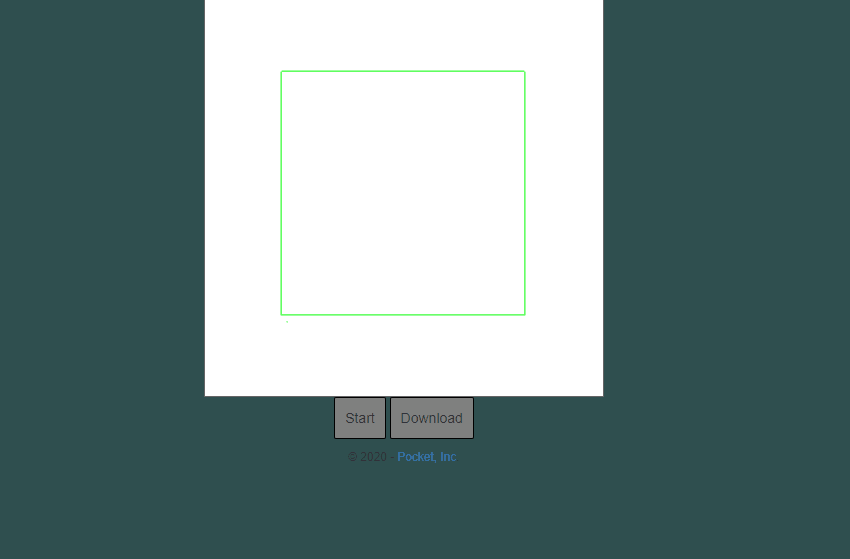

# Pocket Measure
Auto Measures Distance using Ultrasonic sensor and creates a dxf file.

You can also view the dxf file and download it in http://localhost:9966

### Setup:
- npm install
- node write.js
( You'll be asked for first position and second position)
- beefy
( It should show the server is up)
- Go to localhost:9966

### This Project is currently in development.

